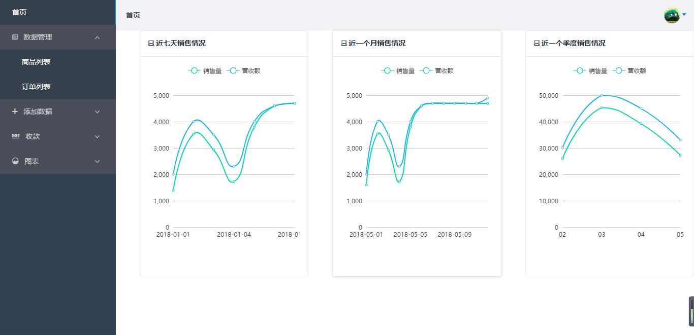
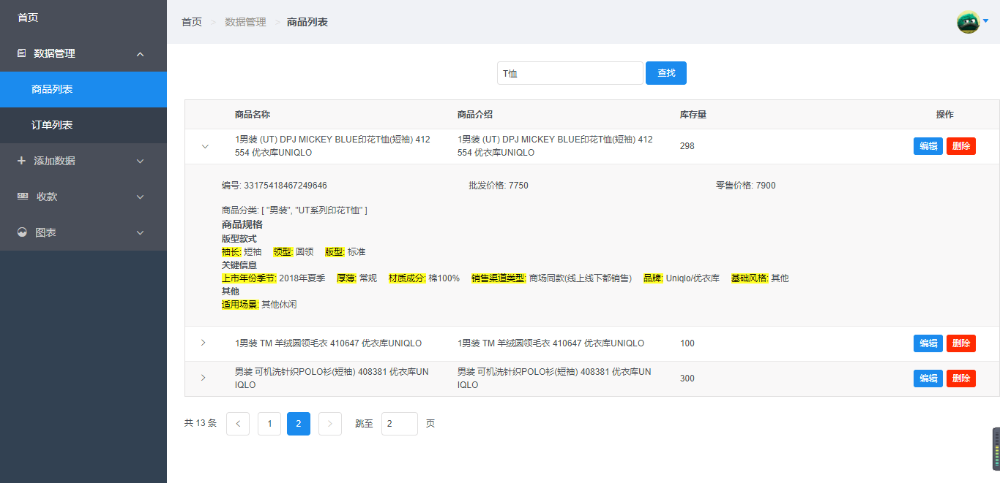
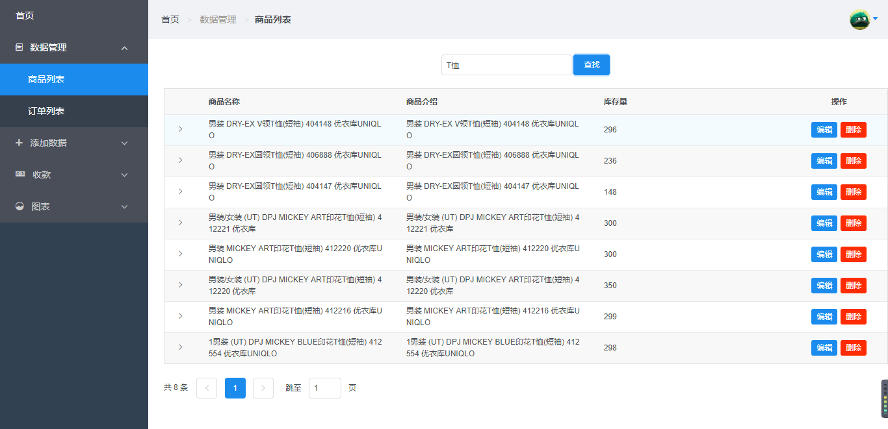
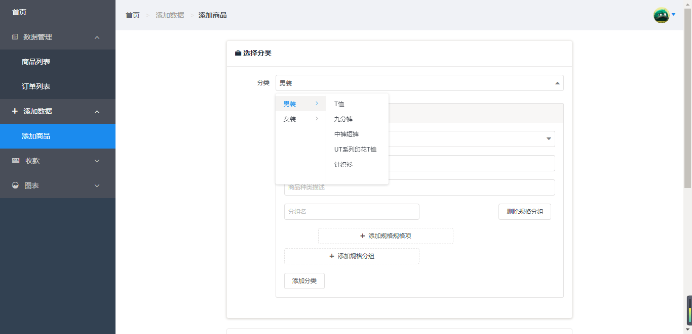
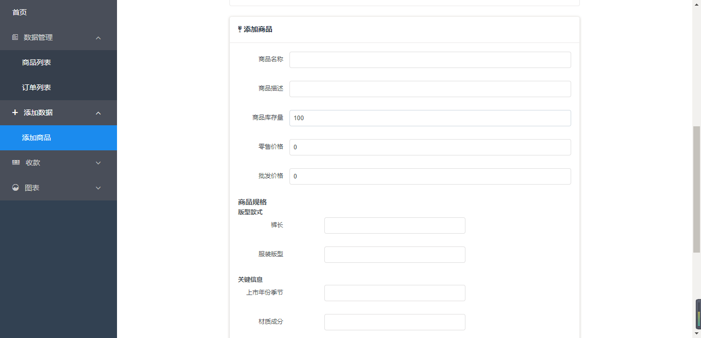
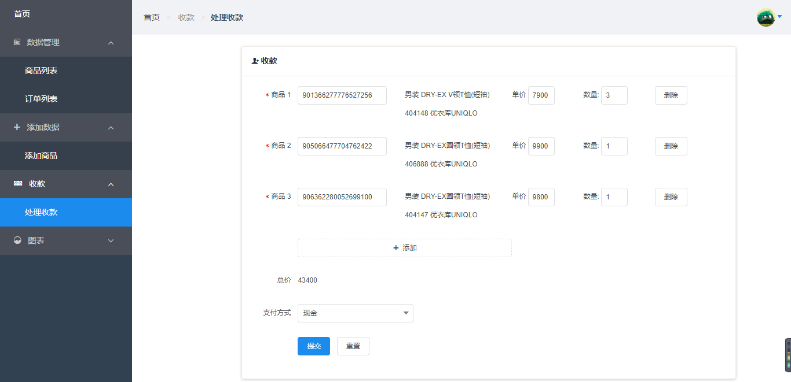
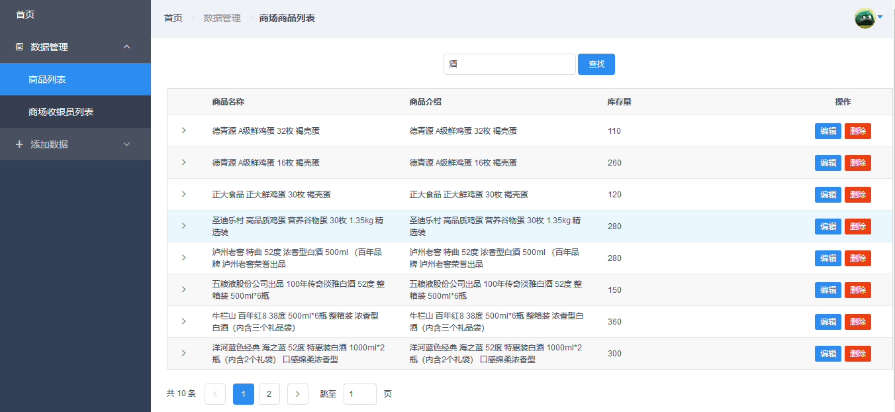
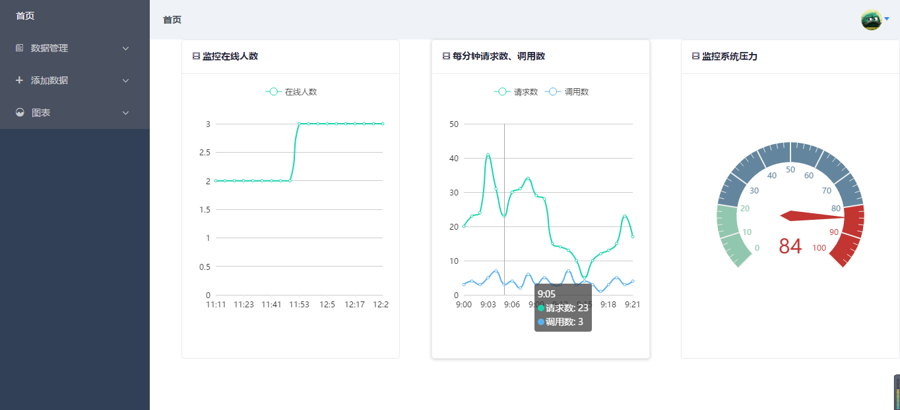
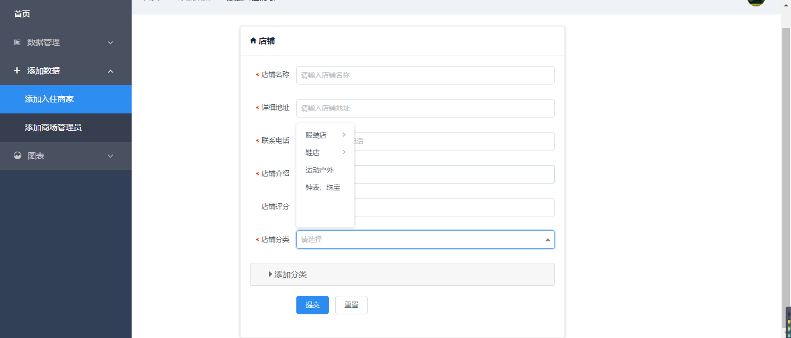
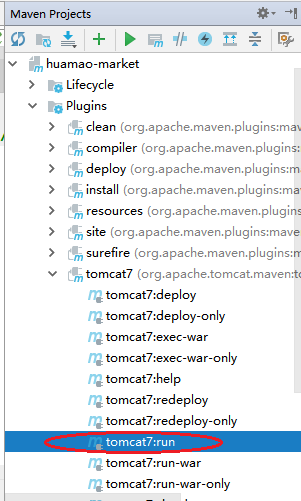

# 商场管理系统

技术栈：Spring MVC + Spring Data MongoDB + MongoDB

  本项目是基于一个虚拟的华贸商场管理系统，该系统可以对用户、商品信息进行管理。系统用户分为系统管理员、商场管理员、商场收银员、入驻商家，每类用户利用该系统完成各自的职责需求。每类用户只能访问各自的操作页面，不能访问其他类用户的模块；系统需要登录才能进一步操作。

> 使用Spring MVC、Vue.js和非关系型数据库MongoDB，应用RESTful架构风格构建系统。系统采用前后端分离独立开发，前端使用Vue.js和基于Vue.js的UI 组件库iView构建前端界面，后端使用Spring MVC发布http服务，前后端交互采用JSON格式数据进行交互，使用axios来跟服务器交互，使用基于 Vue2.0 和 echarts 封装的 v-charts 图表组件来图形化展示数据。使用Spring Data MongoDB操作MongoDB，简化了对数据库操作。


## 部分截图




















## 使用

配合前端项目使用

### 导入数据方法

初始数据在DBdata文件下，首先需要 cd 到 `DBdata/dump/db_hua_mao_market`目录下

导入整个数据库`db_hua_mao_market`

```
mongorestore --db db_hua_mao_market ./
```
`./` 当前目录下都是那些json,bson文件

### 四类用户账号

系统管理员： admin

商场管理员： 张杰

商场收银员： Jack

入驻商家： 优衣库官方旗舰店

为了简单起见，系统所有用户初始密码都是`123456`

当前只是了列出了4个账号，其他账号可以在数据库中找到

### 使用IDEA启动项目



# License

[PGL]: LICENCE.txt